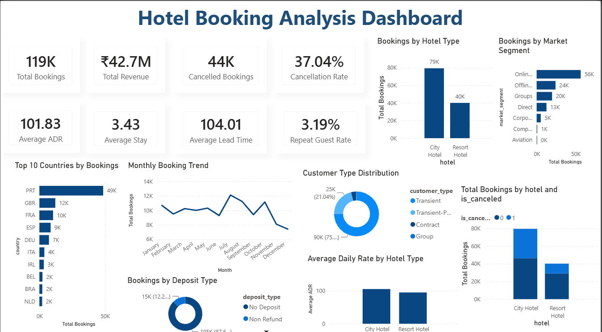
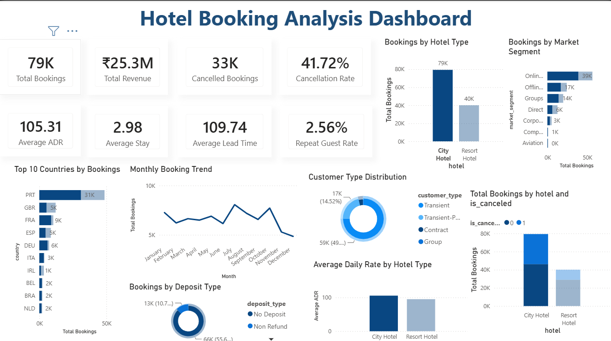
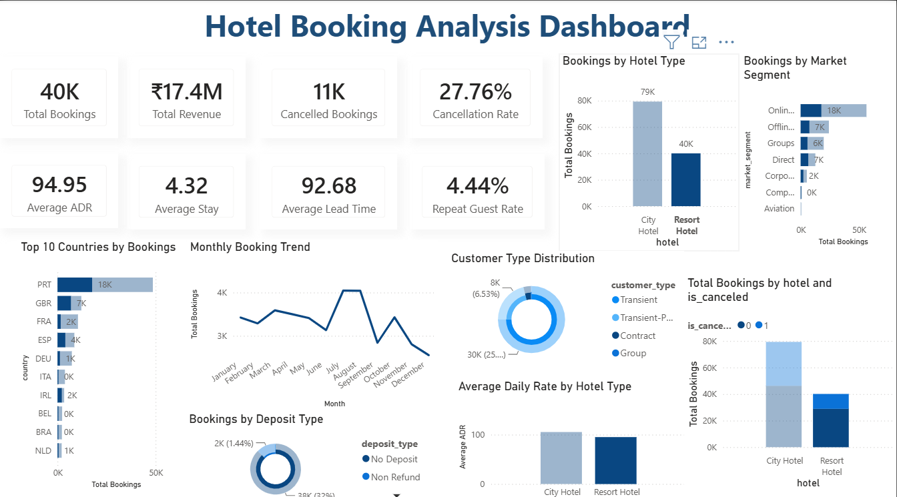

# 🏨 Hotel Booking Analysis

An end-to-end Data Analytics project that analyzes **119,390 hotel booking records** using **Python** and **Power BI** to uncover booking trends, cancellation patterns, customer behavior, and business insights.

---

## 📌 Project Overview

This project aims to help hotel management understand booking patterns, revenue performance, and customer behavior through data analysis and interactive dashboards.

---

## 📂 Dataset

- Total Records: **119,390**
- Hotels: **City Hotel & Resort Hotel**
- Features: **32**

---

## 🛠️ Tools & Technologies

- Python
- Pandas
- NumPy
- Matplotlib
- Seaborn
- Power BI
- Power Query
- DAX
- Git & GitHub

---

## 🧹 Data Cleaning

- Removed duplicate records
- Handled missing values
- Converted date columns
- Corrected data types
- Cleaned categorical values

---

## 📊 Exploratory Data Analysis

Performed analysis on:

- Booking Trends
- Cancellation Analysis
- Hotel Comparison
- Country-wise Analysis
- Average Daily Rate (ADR)
- Monthly Booking Trends
- Customer Types
- Deposit Types

---

## 📈 Power BI Dashboard

### KPI Cards

- Total Bookings
- Total Revenue
- Cancelled Bookings
- Cancellation Rate
- Average ADR
- Average Stay
- Average Lead Time
- Repeat Guest Rate

### Dashboard Visuals

- Monthly Booking Trend
- Bookings by Hotel Type
- Top 10 Countries
- Market Segment Analysis
- Deposit Type Distribution
- Customer Type Distribution
- Average Daily Rate Analysis

---

## 📷 Dashboard Preview

### Complete Dashboard



### City Hotel Analysis



### Resort Hotel Analysis



---

## 💡 Key Business Insights

- City Hotels receive significantly more bookings than Resort Hotels.
- Around **37%** of bookings are cancelled.
- Most customers book without a deposit.
- Portugal contributes the highest number of bookings.
- Average stay duration is around **3.4 nights**.
- Repeat guests account for a small percentage of total bookings.

---

## 📁 Repository Structure

```
hotel-booking-analysis/
│
├── powerbi/
│   └── Hotel Booking Dashboard.pbix
│
├── python/
│   ├── Hotel_Booking_Analysis.ipynb
│   └── hotel_booking_analysis.py
│
├── images/
│   ├── dashboard.png
│   ├── city_hotel_dashboard.png
│   └── resort_hotel_dashboard.png
│
├── hotel_bookings.csv
├── requirements.txt
└── README.md
```

---

## 👨‍💻 Author

**Gaurav Lather**

GitHub: https://github.com/Gaurav68030
